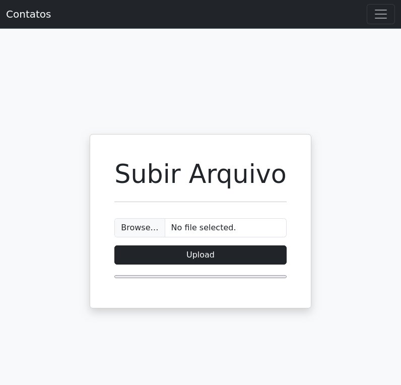
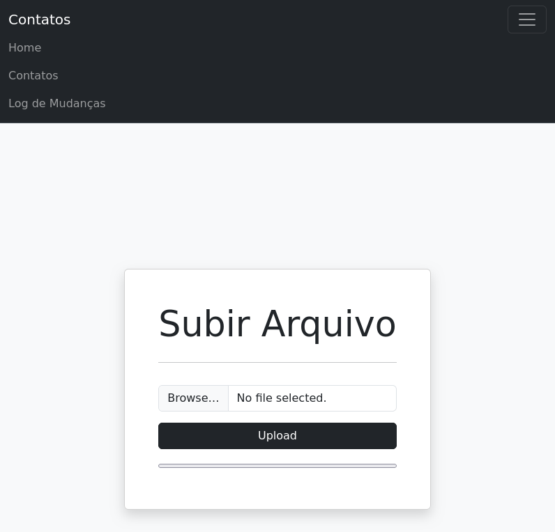
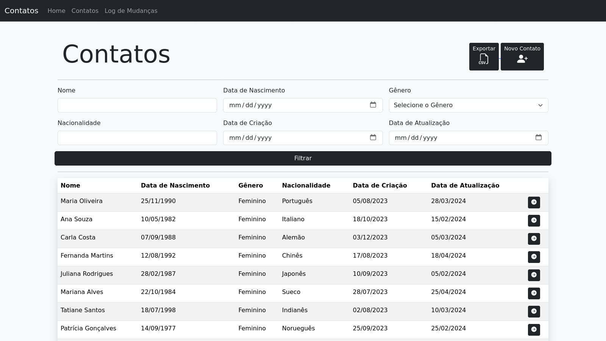
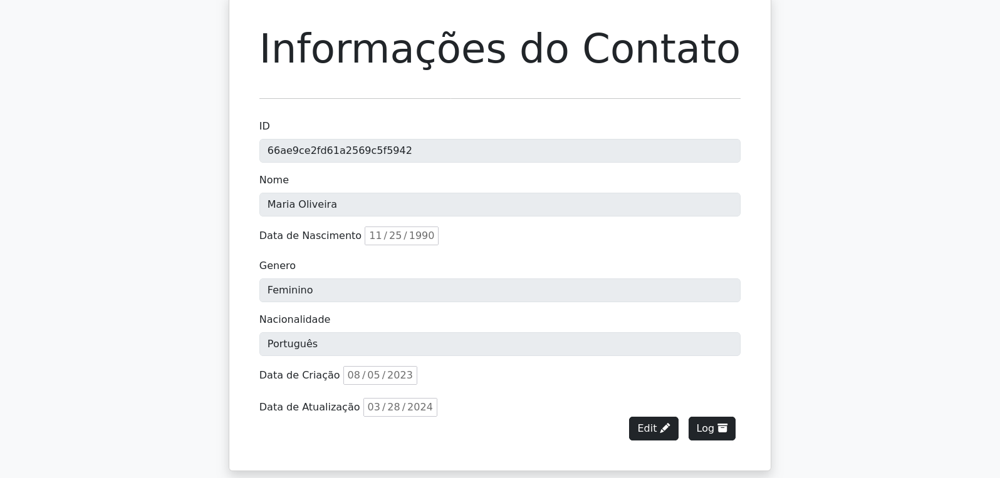
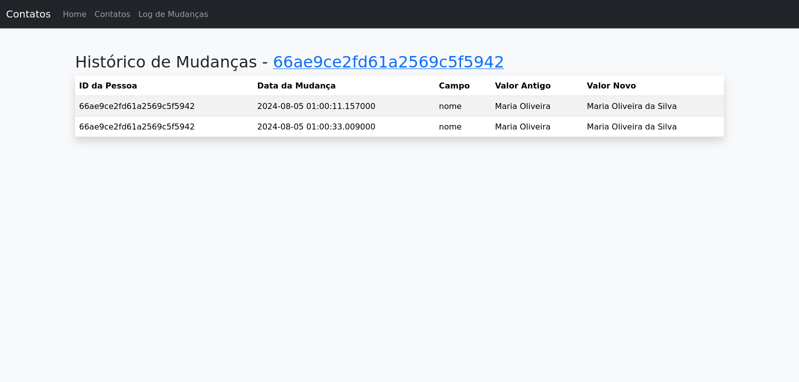

# Persons CSV Parser

## run
Para rodar o projeto é necessário ter o docker instalado e rodar os seguintes comandos:
`docker compose build`
`docker compose up`

## O Projeto

### Adicionar arquivo
 
### Menu expandivel
 
### Tabela de Contatos
 
### Informações do Contato
 
### Changelog Mudanças no Contato
 
